# AWS Serverless Event-Driven Application

A serverless event-driven application built using **AWS Lambda**, **Amazon API Gateway**, and **Amazon DynamoDB**. The application exposes a REST API that accepts task information, triggers a Lambda function to process the request, and stores the data in a DynamoDB table without managing any servers.

---

## 📌 Project Overview

This project demonstrates how to build a fully serverless application on AWS using managed services. The REST API receives HTTP POST requests through API Gateway, invokes a Lambda function, and stores task data in DynamoDB.

This project showcases:
- Serverless computing with AWS Lambda
- REST API development using Amazon API Gateway
- NoSQL database integration with Amazon DynamoDB
- IAM Role configuration and permissions
- Event-driven application architecture
- End-to-end API testing using cURL

---

## 🏗️ Architecture

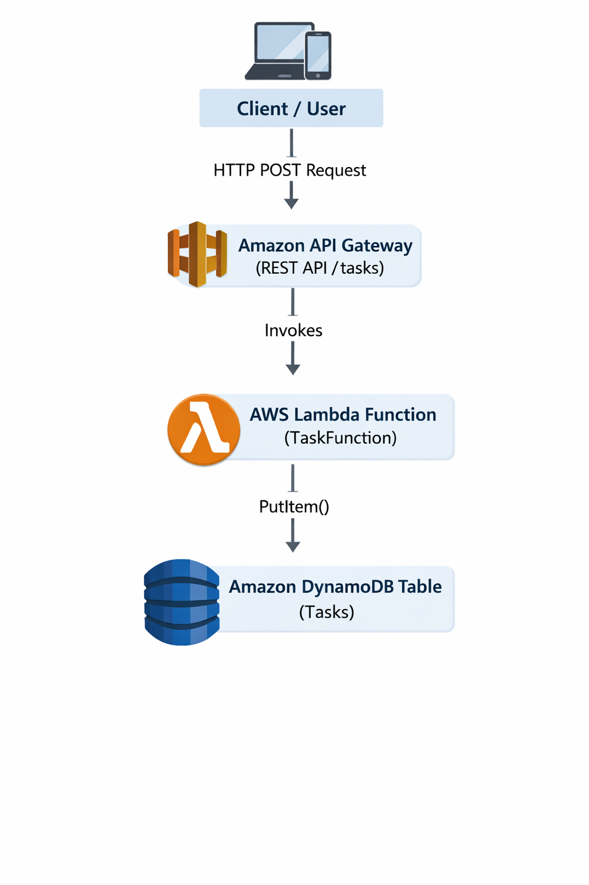

**Workflow**

```
Client
   │
   ▼
Amazon API Gateway
   │
   ▼
AWS Lambda Function
   │
   ▼
Amazon DynamoDB
```

---

## 🛠️ AWS Services Used

- AWS Lambda
- Amazon API Gateway
- Amazon DynamoDB
- AWS Identity and Access Management (IAM)
- Amazon CloudWatch

---

## 📂 Project Structure

```
.
├── lambda_function.py
├── README.md
└── screenshots/
    ├── dynamodb-table-created.png
    ├── iam-role-created.png
    ├── lambda-function-created.png
    ├── lambda-code.png
    ├── lambda-test-success.png
    ├── api-gateway-created.png
    ├── api-resource-created.png
    ├── api-method-created.png
    ├── deploy-api.png
    ├── api-invoke-url.png
    ├── curl-post-success.png
    ├── architecture.png
    └── dynamodb-api-item.png
```

---

# 🚀 Implementation Steps

## Step 1 – Create DynamoDB Table

Created a DynamoDB table named **Tasks** with **id** as the partition key to store task records.

**Screenshot**

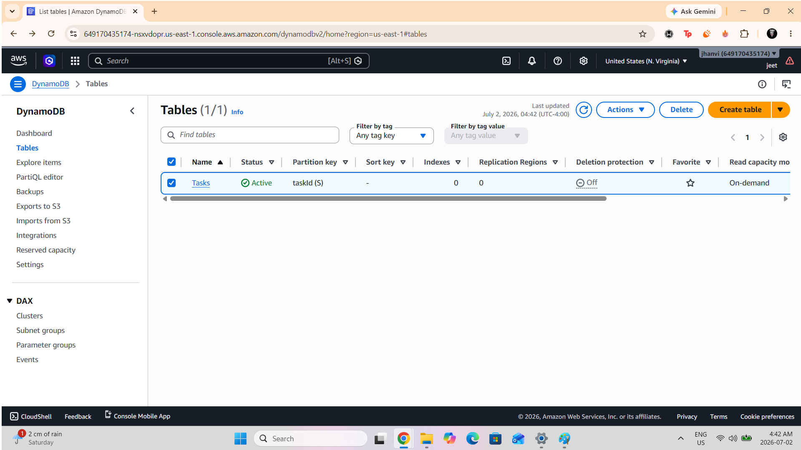

---

## Step 2 – Create IAM Role

Created an IAM role for AWS Lambda with the required DynamoDB permissions.

**Screenshot**

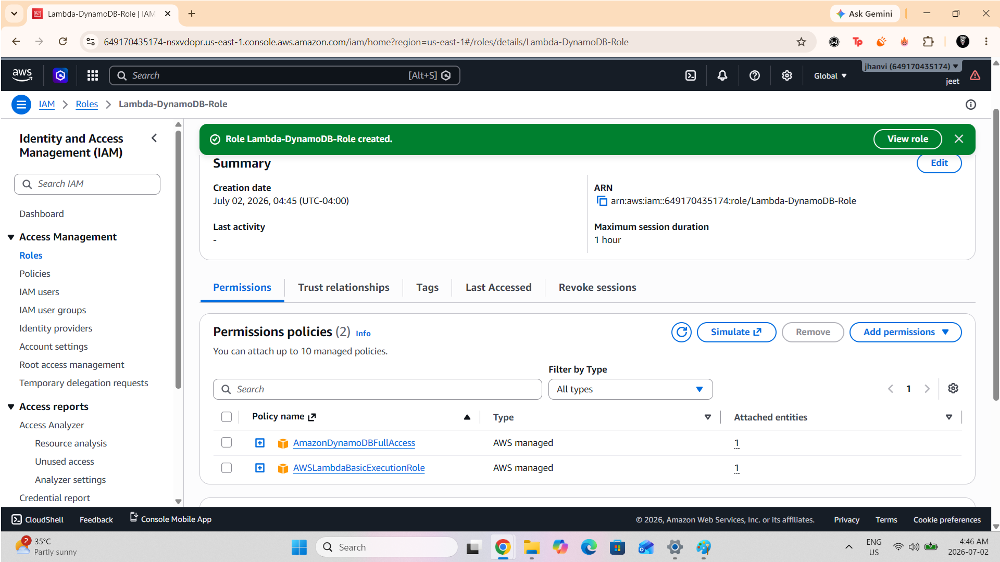

---

## Step 3 – Create Lambda Function

Created a Lambda function named **TaskFunction** using Python runtime.

**Screenshot**

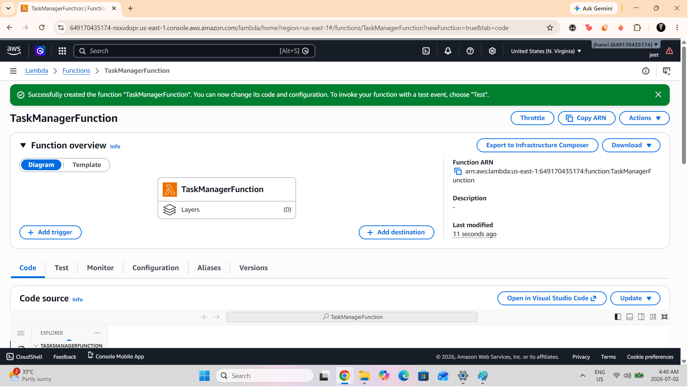

---

## Step 4 – Develop Lambda Function

Implemented Python code to:

- Receive API request
- Generate UUID
- Store task into DynamoDB
- Return success response

**Screenshot**

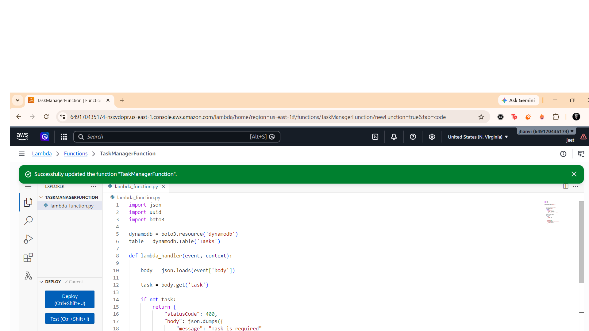

---

## Step 5 – Test Lambda Function

Executed a test event to verify successful insertion into DynamoDB.

**Screenshot**

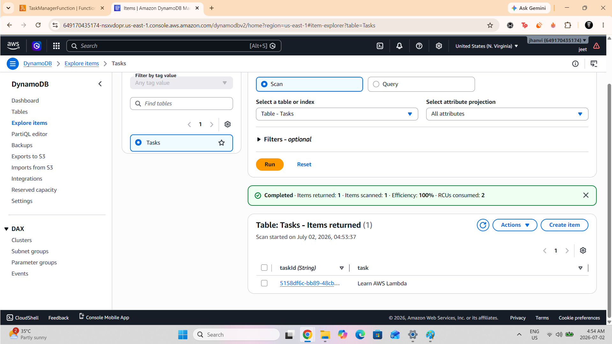

---

## Step 6 – Create REST API

Created a REST API using Amazon API Gateway.

**Screenshot**

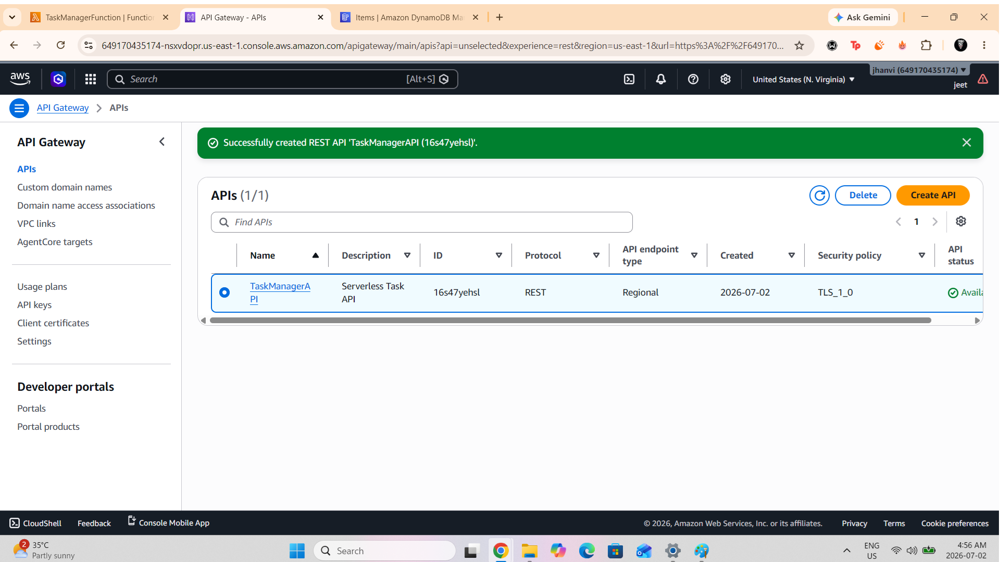

---

## Step 7 – Create API Resource

Created the **/tasks** resource for accepting task requests.

**Screenshot**

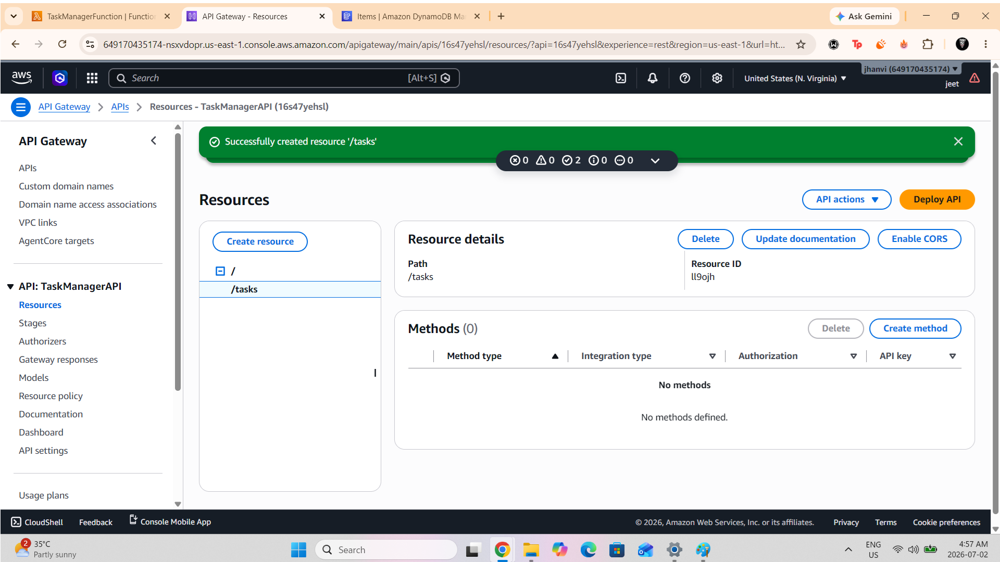

---

## Step 8 – Configure POST Method

Integrated the POST method with the Lambda function.

**Screenshot**

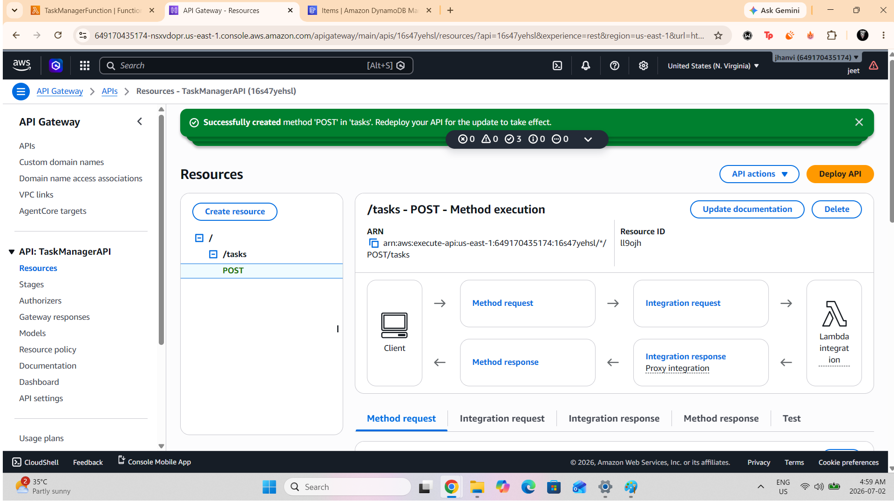

---

## Step 9 – Deploy API

Deployed the API to the **prod** stage.

**Screenshot**

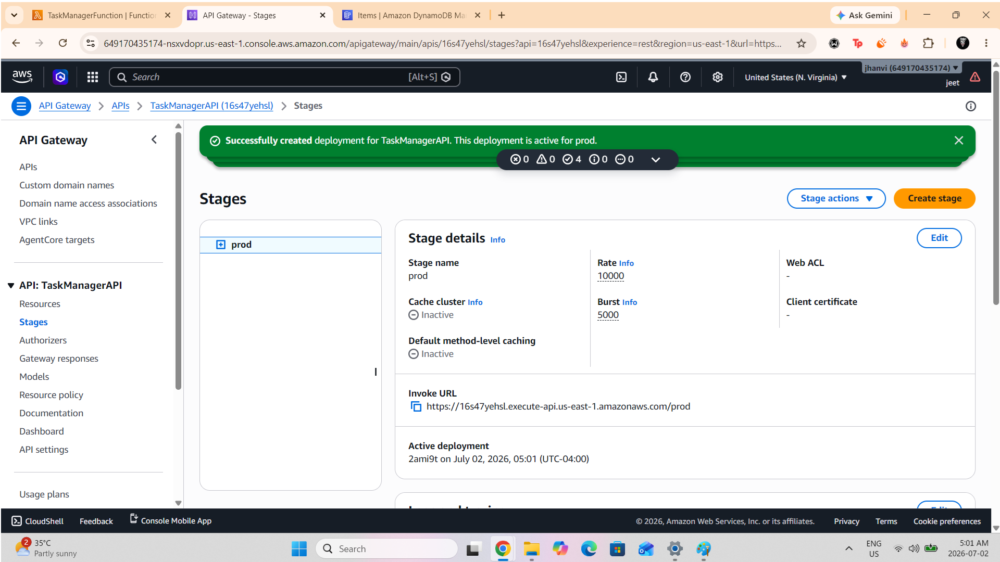

---

## Step 10 – Invoke URL

Generated the public API endpoint.

**Screenshot**

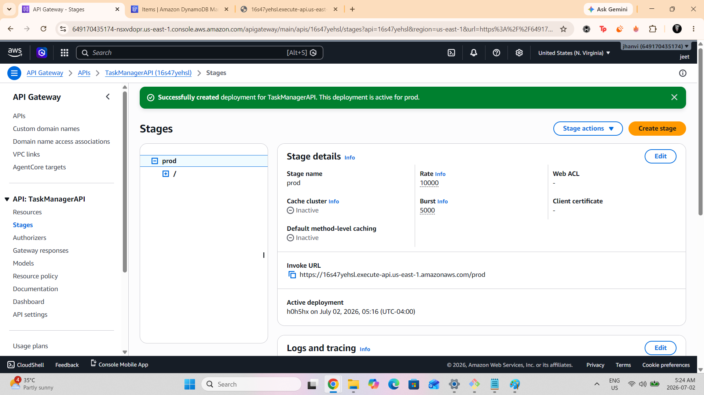

---

## Step 11 – Test REST API

Tested the REST API using cURL.

Example request:

```bash
curl -X POST https://<api-id>.execute-api.us-east-1.amazonaws.com/prod/tasks \
-H "Content-Type: application/json" \
-d '{"task":"Learn AWS Serverless"}'
```

**Screenshot**

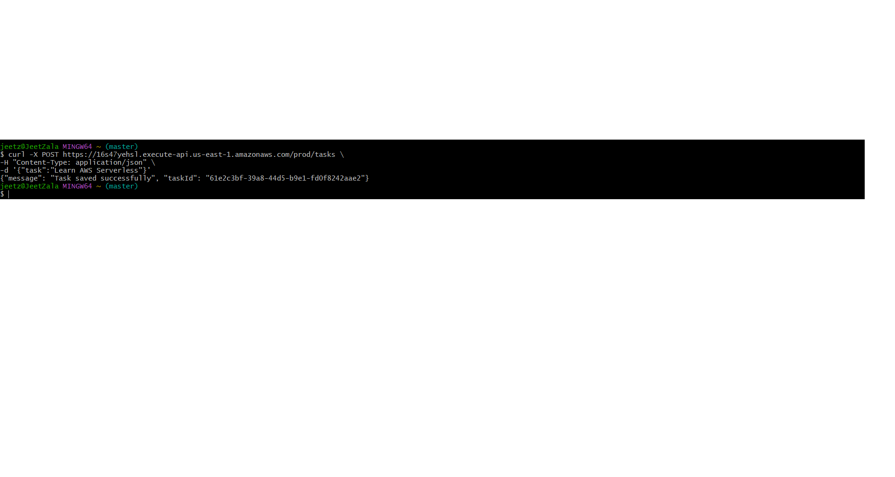

---

## Step 12 – Verify Data in DynamoDB

Verified that the submitted task was successfully stored in the DynamoDB table.

**Screenshot**

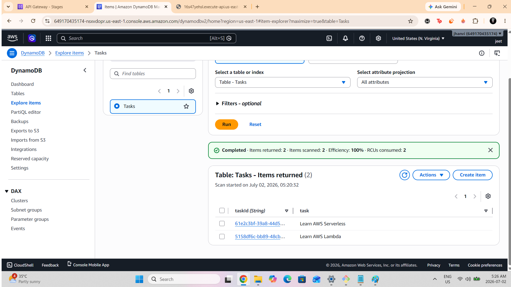

---

# 📈 Request Flow

```
Client
   │
   │ POST /tasks
   ▼
Amazon API Gateway
   │
   ▼
AWS Lambda Function
   │
   │ PutItem()
   ▼
Amazon DynamoDB
   │
   ▼
Success Response
```

---

# 📋 Sample Request

```json
{
    "task": "Learn AWS Serverless"
}
```

---

# 📋 Sample Response

```json
{
    "message": "Task added successfully"
}
```

---

# 🎯 Key Learning Outcomes

- Built a fully serverless application using AWS managed services.
- Created and configured AWS Lambda functions.
- Integrated Amazon API Gateway with Lambda.
- Stored application data in Amazon DynamoDB.
- Configured IAM roles and permissions.
- Tested REST APIs using cURL.
- Understood event-driven architecture on AWS.
- Implemented a scalable and serverless backend.

---

# 🧹 AWS Resource Cleanup

After completing the project, the following AWS resources were removed:

- API Gateway REST API
- Lambda Function
- IAM Role
- DynamoDB Table
- CloudWatch Log Groups

This cleanup ensures no unnecessary AWS charges are incurred.

---

# 📚 Skills Demonstrated

- AWS Lambda
- Amazon API Gateway
- Amazon DynamoDB
- IAM
- CloudWatch
- REST APIs
- Serverless Architecture
- Event-Driven Computing
- Python
- JSON

---

## 👤 Author

**Jeet Zala**

Cloud & DevOps Enthusiast

GitHub: https://github.com/jeetzala
