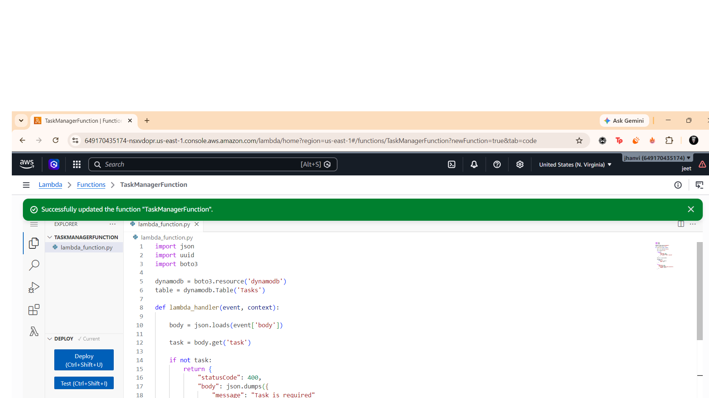
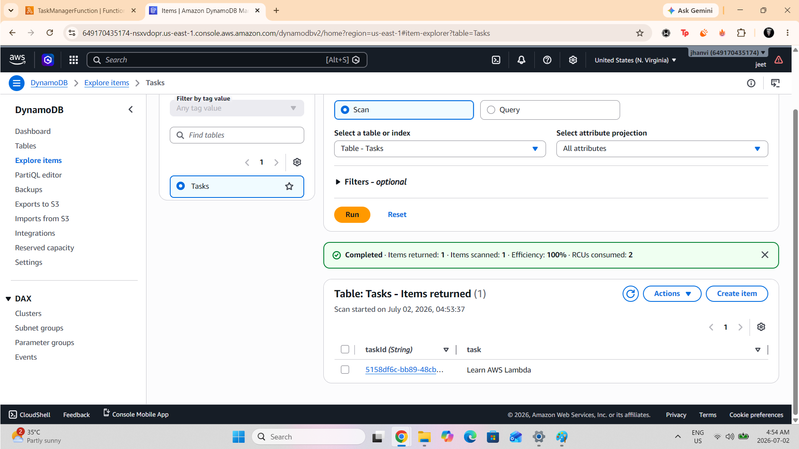
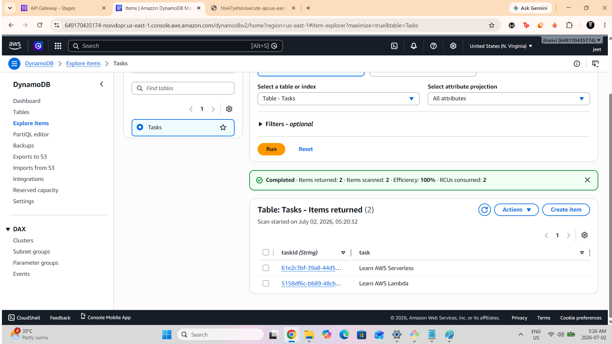

# ☁️ AWS Serverless Task API

This project demonstrates the design and deployment of a serverless task management API on **Amazon Web Services (AWS)** using **AWS Lambda, Amazon API Gateway HTTP API, Amazon DynamoDB, AWS IAM, Amazon CloudWatch, and Terraform**.

The application provides a complete CRUD API for creating, reading, updating, and deleting task records. AWS Lambda handles the application logic, Amazon DynamoDB provides persistent NoSQL storage, and Amazon API Gateway provides the public HTTP interface.

The project was built, improved, deployed, and validated in the AWS **Europe (Frankfurt)** Region (`eu-central-1`).

---

# 🚀 Project Highlights

✅ Python 3.11 AWS Lambda Application

✅ Complete CRUD API

✅ Amazon API Gateway HTTP API

✅ API Gateway Payload Format 2.0

✅ Amazon DynamoDB

✅ UUID-based Task IDs

✅ UTC timestamps

✅ Input validation

✅ HTTP error handling

✅ Conditional updates

✅ Conditional deletes

✅ Structured JSON application logging

✅ Amazon CloudWatch Logs

✅ API Gateway request throttling

✅ IAM least-privilege access

✅ Terraform Infrastructure as Code

✅ Local Python testing

✅ End-to-end live AWS API testing

✅ Terraform infrastructure drift validation

✅ AWS resource cleanup

---

# 🏗️ Architecture Overview

## Architecture Diagram


The application follows this request flow:

```text
                         Client
                           │
                           │ HTTP Request
                           ▼
                Amazon API Gateway
                    HTTP API (v2)
                           │
                           │ AWS Proxy
                           │ Payload 2.0
                           ▼
                    AWS Lambda
               serverless-task-api-dev
                           │
                           │ boto3
                           ▼
                  Amazon DynamoDB
            serverless-task-api-dev-tasks
```

Supporting services provide security and observability:

```text
AWS Lambda
    │
    ├── IAM Execution Role
    │       ├── DynamoDB CRUD permissions
    │       └── CloudWatch Logs permissions
    │
    └── CloudWatch Logs
            └── /aws/lambda/serverless-task-api-dev

API Gateway
    │
    └── Default Stage
            ├── Rate Limit: 10 requests/second
            └── Burst Limit: 20 requests
```

The infrastructure is represented and managed using **Terraform**.

---

# 🧱 Infrastructure Components

## Application

The Lambda application provides:

* Python 3.11 runtime
* Task creation
* Task retrieval
* Task listing
* Task updates
* Task deletion
* UUID generation
* UTC timestamps
* Request validation
* Structured logging
* Error handling

## API Layer

Amazon API Gateway HTTP API provides:

* Public HTTP endpoint
* HTTP routing
* Lambda proxy integration
* Payload format 2.0
* CRUD route configuration
* Request throttling

## Database

Amazon DynamoDB provides:

* NoSQL persistence
* `id` as the partition key
* On-demand billing mode
* Serverless scaling
* Create, read, update, and delete operations

## Security & Operations

The project uses:

* AWS IAM
* Least-privilege permissions
* Amazon CloudWatch Logs
* Structured JSON application logs
* API Gateway throttling
* Input validation
* Controlled error responses

## Infrastructure as Code

Terraform manages:

* DynamoDB table
* Lambda function
* IAM role
* IAM inline policy
* CloudWatch log group
* API Gateway HTTP API
* API Gateway integration
* API Gateway routes
* API Gateway stage
* Lambda permission

---

# 🛠️ AWS Services Used

* AWS Lambda
* Amazon API Gateway HTTP API
* Amazon DynamoDB
* AWS Identity and Access Management (IAM)
* Amazon CloudWatch
* Terraform

---

# 🔐 Security Architecture

The API is publicly accessible through API Gateway for portfolio testing.

The current API routes use:

```text
Authorization: NONE
```

Authentication is intentionally not configured in this version of the project.

The project instead focuses on:

* IAM least-privilege access
* Restricted DynamoDB permissions
* Restricted CloudWatch permissions
* API Gateway throttling
* Input validation
* Conditional database operations
* Controlled error responses
* Avoiding unnecessary infrastructure exposure

The Lambda execution role receives only the DynamoDB actions required by the application:

```text
dynamodb:GetItem
dynamodb:PutItem
dynamodb:UpdateItem
dynamodb:DeleteItem
dynamodb:Scan
```

CloudWatch logging permissions are limited to:

```text
logs:CreateLogStream
logs:PutLogEvents
```

The DynamoDB permissions are scoped to the project table rather than granting unrestricted DynamoDB access.

---

# 🔄 API Endpoints

| Method | Endpoint      | Description       |
| ------ | ------------- | ----------------- |
| POST   | `/tasks`      | Create a task     |
| GET    | `/tasks`      | List all tasks    |
| GET    | `/tasks/{id}` | Retrieve one task |
| PUT    | `/tasks/{id}` | Update a task     |
| DELETE | `/tasks/{id}` | Delete a task     |

---

# 📋 Sample Request

## Create Task

```http
POST /tasks
Content-Type: application/json
```

```json
{
  "task": "Learn AWS Serverless"
}
```

---

# 📋 Sample Response

```json
{
  "message": "Task created successfully.",
  "task": {
    "id": "5814d1ba-3fd5-4be8-a1e0-bfc54633b9a3",
    "task": "Learn AWS Serverless",
    "createdAt": "2026-09-29T11:22:29.991952+00:00",
    "updatedAt": "2026-09-29T11:22:29.991952+00:00"
  }
}
```

The task ID is generated using **UUID**.

Timestamps are stored in **UTC** using ISO 8601 format.

---

# 📈 Request Flow

## Create Task

```text
Client
   │
   │ POST /tasks
   ▼
Amazon API Gateway HTTP API
   │
   │ Payload Format 2.0
   ▼
AWS Lambda
   │
   │ put_item()
   ▼
Amazon DynamoDB
   │
   ▼
JSON Response
```

## Update Task

```text
Client
   │
   │ PUT /tasks/{id}
   ▼
Amazon API Gateway
   │
   ▼
AWS Lambda
   │
   │ update_item()
   │
   │ ConditionExpression:
   │   attribute_exists(id)
   ▼
Amazon DynamoDB
   │
   ▼
Updated Task
```

The same conditional approach is used for deletion so that nonexistent tasks return `404` instead of being silently accepted.

---

# ✅ API Validation & Error Handling

The application validates incoming requests before performing database operations.

## Missing Task

```json
{
  "error": "The 'task' field is required and cannot be empty."
}
```

Returns:

```text
400 Bad Request
```

## Invalid JSON

```json
{
  "error": "Invalid JSON request body."
}
```

Returns:

```text
400 Bad Request
```

## Task Not Found

```json
{
  "error": "Task not found."
}
```

Returns:

```text
404 Not Found
```

## Unsupported Method

```json
{
  "error": "Method not allowed."
}
```

Returns:

```text
405 Method Not Allowed
```

This provides predictable responses for invalid requests and database conditions.

---

# 📊 CloudWatch Structured Logging

The Lambda function uses **structured JSON logging**.

CloudWatch records fields such as:

```json
{
  "message": "API request received",
  "httpMethod": "GET",
  "path": "/tasks",
  "requestId": "9e9b8401-89ea-45fb-929e-af4c85fb3985"
}
```

Task operations also generate application events such as:

```json
{
  "message": "Tasks listed",
  "taskCount": 0
}
```

The Lambda CloudWatch log group is:

```text
/aws/lambda/serverless-task-api-dev
```

Log retention is configured for:

```text
7 days
```

Structured JSON logging makes it easier to troubleshoot requests and identify application events in CloudWatch.

---

# 🚦 API Gateway Throttling

The HTTP API default stage is configured with request-rate protection:

```text
Rate Limit:
10 requests/second

Burst Limit:
20 requests
```

This provides basic request-rate protection for the public API.

API Gateway throttling is a request-rate control mechanism and should not be treated as an absolute AWS cost ceiling.

---

# 🧪 Local Testing

Before deploying to AWS, the Lambda code was tested locally using Python.

The project includes:

```text
test_lambda.py
```

A local `FakeTable` is used to simulate DynamoDB so that application behavior can be tested without relying on live AWS resources.

The test suite verifies:

```text
POST /tasks
GET /tasks
GET /tasks/{id}
PUT /tasks/{id}
DELETE /tasks/{id}
```

It also verifies:

```text
Invalid task input
Invalid JSON
Missing task
Nonexistent task updates
Nonexistent task deletes
Unsupported HTTP methods
API Gateway HTTP API payload format 2.0
```

Final local validation:

```text
✅ All CRUD, validation, and HTTP API v2 tests passed successfully.
```

---

# 🌍 End-to-End AWS Validation

After the local tests passed, the application was deployed to AWS using Terraform.

The live API was then tested using PowerShell.

## Create

```text
POST /tasks
→ 201 Created
```

## Read

```text
GET /tasks/{id}
→ 200 OK
```

## Update

```text
PUT /tasks/{id}
→ 200 OK
```

## Verify Update

```text
GET /tasks/{id}
→ Updated task returned
```

## Delete

```text
DELETE /tasks/{id}
→ 200 OK
```

## Verify Deletion

```text
GET /tasks/{id}
→ 404 Task not found
```

The complete CRUD flow was successfully validated against the live AWS environment.

---

# 🧰 Terraform Infrastructure as Code

Terraform is used to provision and manage the serverless infrastructure.

Terraform configuration is stored in:

```text
terraform/
```

## Terraform Files

```text
main.tf
iam.tf
variables.tf
outputs.tf
.terraform.lock.hcl
```

## Terraform-Managed Resources

Terraform manages:

```text
Amazon DynamoDB Table
AWS Lambda Function
IAM Role
IAM Inline Policy
CloudWatch Log Group
API Gateway HTTP API
API Gateway Integration
API Gateway Routes
API Gateway Stage
Lambda Permission
```

## Terraform Workflow

Initialize Terraform:

```bash
terraform init
```

Validate the configuration:

```bash
terraform validate
```

Format the configuration:

```bash
terraform fmt
```

Review the planned changes:

```bash
terraform plan
```

Deploy the infrastructure:

```bash
terraform apply
```

After deployment and configuration updates, Terraform was run again to verify infrastructure consistency:

```bash
terraform plan
```

Final result:

```text
No changes.
Your infrastructure matches the configuration.
```

This confirmed that the deployed infrastructure matched the Terraform configuration at the time of validation.

---

# 📁 Project Structure

```text
aws-serverless-task-api/
│
├── lambda_function.py
├── test_lambda.py
├── README.md
├── .gitignore
├── .gitattributes
│
├── terraform/
│   ├── main.tf
│   ├── iam.tf
│   ├── variables.tf
│   ├── outputs.tf
│   └── .terraform.lock.hcl
│
└── screenshots/
```

Terraform-generated files are excluded from the Git repository:

```text
.terraform/
*.tfstate
*.tfstate.*
*.zip
```

---

# 🚀 Implementation Steps

## Step 1 – Review Existing Serverless Application

The original project provided a basic Lambda, API Gateway, and DynamoDB implementation.

The existing application was improved and extended rather than creating a separate project.

---

## Step 2 – Upgrade Lambda to CRUD

The Lambda function was extended to support a complete CRUD workflow:

```text
POST
GET
GET by ID
PUT
DELETE
```

---

## Step 3 – Add Input Validation

Validation was added for:

* Missing task field
* Empty task values
* Invalid JSON
* Missing task IDs

Appropriate HTTP status codes are returned for invalid requests.

---

## Step 4 – Add Error Handling

The Lambda function handles:

* JSON parsing errors
* DynamoDB conditional failures
* Database operation errors
* Unexpected runtime errors
* Unsupported HTTP methods

---

## Step 5 – Add API Gateway HTTP API v2 Support

The Lambda application was updated to support **API Gateway Payload Format 2.0**.

HTTP methods can be read from:

```text
requestContext.http.method
```

This allows the Lambda function to correctly process requests from the deployed HTTP API integration.

---

## Step 6 – Create Local Test Suite

A local Python test suite was created using a simulated DynamoDB table.

This allowed the application logic and CRUD behavior to be tested before relying on live AWS resources.

---

## Step 7 – Create Terraform Infrastructure

Terraform configuration was created to represent the serverless architecture as **Infrastructure as Code**.

The configuration manages the application, database, API layer, IAM configuration, logging, and Lambda integration.

---

## Step 8 – Configure IAM Least Privilege

The Lambda execution role was configured with only the DynamoDB and CloudWatch permissions required by the application.

The DynamoDB permissions are scoped to the project table.

---

## Step 9 – Deploy to AWS

Terraform was used to deploy the serverless application into:

```text
eu-central-1
```

The deployed architecture includes:

```text
Lambda
API Gateway
DynamoDB
IAM
CloudWatch
```

---

## Step 10 – Validate Live CRUD Operations

The deployed API was tested end-to-end against the live AWS environment.

The complete workflow successfully completed:

```text
Create
Read
Update
Read after update
Delete
Read after delete
```

---

## Step 11 – Add Structured Logging

Lambda application logging was changed to structured JSON.

Application events now expose useful request and task information for CloudWatch-based troubleshooting.

---

## Step 12 – Add API Throttling

API Gateway request-rate protection was added:

```text
10 requests/second
20 request burst
```

This adds basic request-rate control to the public HTTP API.

---

## Step 13 – Verify Infrastructure Drift

Terraform was run again after deployment and hardening.

Final result:

```text
No changes.
Your infrastructure matches the configuration.
```

This confirmed that the deployed infrastructure remained synchronized with the Terraform configuration.

---

# 📸 Screenshots

Only screenshots that provide meaningful portfolio evidence are included here. Redundant screenshots showing the same configuration or intermediate setup steps are intentionally not included in the README.

## 1. Architecture Diagram


Shows the complete serverless request flow and supporting AWS services.

---

## 2. API Gateway HTTP API


Shows the deployed Amazon API Gateway HTTP API configuration.

---

## 3. Lambda Function


Shows the deployed Lambda function and its AWS configuration.

---

## 4. Lambda Code



Shows the Lambda implementation responsible for processing the API requests and database operations.

---

## 5. Lambda Test



Shows successful Lambda testing before or during AWS validation.

---

## 6. DynamoDB Table


Shows the DynamoDB table used to persist task records.

The table uses:

```text
id
```

as the partition key.

---

## 7. DynamoDB API Item



Shows task data stored in DynamoDB as a result of API activity.

---

## 8. IAM Least Privilege


Shows the least-privilege IAM permissions configured for the Lambda application.

---

## 9. CloudWatch JSON Logs


Shows structured JSON application logs generated by the deployed Lambda function.

---

## 10. API Gateway Throttling


Shows the configured request-rate protection:

```text
Rate Limit: 10 requests/second
Burst Limit: 20 requests
```

---

## 11. Live CRUD Test


Shows end-to-end validation of the deployed API and CRUD operations.

---

## 12. Terraform No Changes


Shows the final Terraform validation:

```text
No changes.
Your infrastructure matches the configuration.
```

---

# 🧹 AWS Resource Cleanup

The project was deployed temporarily for development, testing, and validation.

When AWS testing is complete, the infrastructure can be removed with:

```bash
cd terraform
terraform destroy
```

Terraform will remove the AWS resources managed by the configuration.

This project uses serverless, usage-based AWS services, but AWS usage can still generate charges depending on account eligibility and actual consumption. Temporary test resources should therefore be removed after validation is complete.

---

# 🎯 Key Learning Outcomes

Through this project, I practiced:

* Building serverless applications with AWS Lambda
* Designing HTTP APIs using Amazon API Gateway
* Implementing complete CRUD operations
* Working with Amazon DynamoDB
* Using UUIDs and timestamps
* Implementing request validation
* Handling application and database errors
* Using DynamoDB conditional expressions
* Implementing structured CloudWatch logging
* Applying API Gateway throttling
* Creating least-privilege IAM policies
* Managing AWS infrastructure with Terraform
* Validating Terraform infrastructure
* Testing Lambda logic locally
* Testing a live AWS API end-to-end
* Troubleshooting AWS serverless applications
* Managing temporary AWS resources and cleanup

---

# 📚 Skills Demonstrated

* AWS Lambda
* Amazon API Gateway HTTP API
* Amazon DynamoDB
* AWS IAM
* Amazon CloudWatch
* Terraform
* Infrastructure as Code
* Serverless Architecture
* API Development
* HTTP API Concepts
* Python
* boto3
* JSON
* CRUD Operations
* Error Handling
* Structured Logging
* Monitoring
* API Throttling
* AWS Troubleshooting

---

# 👤 Author

**Jeet Zala**

Cloud & DevOps Enthusiast

GitHub: https://github.com/jeetzala

LinkedIn: https://www.linkedin.com/in/jeet-zala-6633832ba
